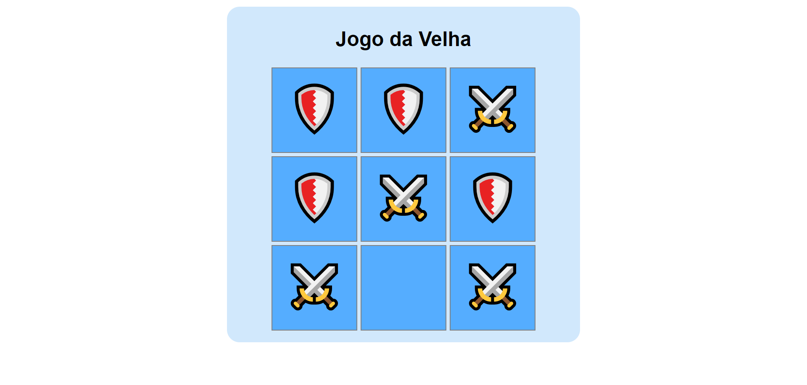

  

# ⚔ Jogo da Velha 🛡
Projeto do curso ProgramadorBR em que aprendi a desenvolver a lógica por trás do jogo da velha. Projeto simples mas bem legal de fazer, pretendo fazer uma versão melhorada e atualizada no futuro com React.

## 🚀 Tecnologias

- [HTML](https://www.w3schools.com/html/)
- [CSS](https://developer.mozilla.org/pt-BR/docs/Web/CSS)
- [JavaScript](https://developer.mozilla.org/pt-BR/docs/Web/JavaScript)

## 📝 Considerações
Em breve irei refazer esse projeto com melhorias e com as funcionalidades completas.
